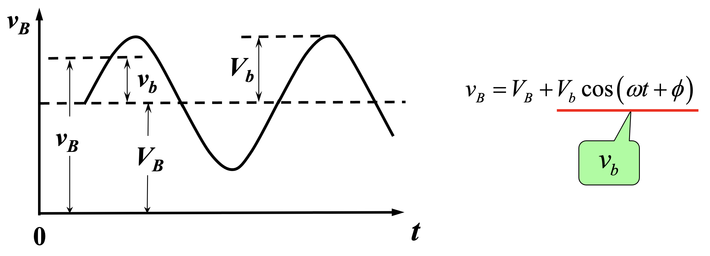

# 电路基本概念

::: tip 

1. 集总参数 vs. 分布参数

   * **集总参数电路**（lumped circuit）: 实际电路的尺寸远小于电路工作时电磁波的波长。【本课程主要考虑集总参数电路】

   * **分布参数电路**（distributed circuit）: 实际电路的尺寸与电路工作时电磁波的波长相当或更大。一般超过**十分之一**波长时需要考虑。如蓝牙工作频率 2.4 GHz， $\frac{1}{10}\lambda \approx \frac{0.3\,Gm/s}{2.4 \,GHz}\times 0.1=12.5mm$, 故蓝牙PCB电路中，铜线超过12.5 mm后需要考虑传输线分布效应

2. 参考方向

   * **电流参考方向**：因事先不知道**流过元件**的实际电流方向，故可假定电流的方向，这一假定的方向即为电流参考方向；

   * **电压参考方向**：因事先不知道**元件两端**电压的高低，故可假定一端电压高（标记为﹢）、另一端电压低（标记为﹣），这一假定的﹢﹣即为电压参考方向；

   * **关联参考方向**：电流参考方向从元件的﹢端流进；

   * **非关联参考方向**：电流参考方向从元件的﹣端流进；

   * **关联参考方向的意义**：功率p大于0，表示元件吸收功率（消耗能量），如电阻；功率p小于0，表示元件释放功率（提供能量），如电源。

3. 符号规范

   * 大写字母、大写下标，直流量，$V_B$

   * 大写字母、小写下标，交变信号的幅度，$V_b$

   * 小写字母、大写下标，瞬时总量，$v_B$

   * 小写字母、小写下标，增量信号（交变小信号），$v_b$

   * **字母大写**表示恒定的量；**字母小写**表示随时间变化的量

4. 电荷、电流、电压、功率
   * 电流：单位时间内流过的电荷，$i \triangleq \frac{dq}{dt}$
   * 电压：移动单位电荷所需要的能量（从 *b* 节点移动到 *a* 节点），$v_{ab} \triangleq \frac{dw}{dq}$; 两节点间的电压也指两节点相对于“地”节点的电势之差 $v_{ab} = v_a - v_b$
   * 功率：单位时间内消耗或吸收的能量， $p = \frac{dw}{dt} = \frac{dw}{dq} \cdot \frac{dq}{dt} = v \cdot i$
5. 电阻和欧姆定律
   * $v = i \cdot R$
   * 自然界常见金属电导率排序：Ag > Cu > Au > Al

6. 电容电感
   * 电容是储能元件，存储电荷或电场能量 $q = C \cdot v$ ； $w_C = \frac{1}{2} \cdot C \cdot v^2$
   * 电容的电压电流约束关系：$i = C \frac{dv}{dt}$; 电容两端电压不能突变，否则电流会无穷大；
   * 电感也是储能元件，储存磁场能量 $w_L = \frac{1}{2} \cdot L \cdot i^2$
   * 电感的电压电流约束关系：$v = L \frac{di}{dt}$ ; 流过电感的电流不能突变，否则电压会无穷大；
7. KCL的两种表述
   * 流入任一节点（或闭合界面）的支路电流的代数和为0；电荷守恒；
   * 对于任一节点，流入电流总和 = 流出电流总和；
8. KVL的两种表述
   * 沿任一回路，所有支路电压的代数和为0；能量守恒；
   * 两节点间若有多条路径，则每条路径上的电压降相等（电压与路径无关）；

:::

# 习题及参考解答

## 知识点1：电压电流参考方向

1、电流与电压为关联参考方向是指 ________ 。

A. 电流参考方向与电压降参考方向一致

B. 电流参考方向与电压升参考方向一致

C. 电流实际方向与电压升实际方向一致

D. 电流实际方向与电压降实际方向一致

2、当电压和电流选取关联参考方向时，计算得到某元件消耗的功率值为负，则表示该元件实际是 ________ 功率。

A. 产生		B. 吸收		C. 与元件类型有关		D. 无法判断

**参考解答**

1. A
2. A

## 知识点2：电容电感的性质

1、电容不可能发生跃变的是 ________ ，电感不可能发生跃变的是 ________ 。

A. 两端的电压		B. 通过的电流

2、当电容器内的总电荷量加倍时，其储存的能量 ________ 。

A. 保持不变	B. 减半	C. 加倍	D. 为原来的4倍

3、关于有限激励下的动态电路的描述，以下错误的有 ________ 。

A. 电容两端电压不能突变						B. 流经电感的电流不能突变

C. 电容和电感的储能均不能突变			D. 以上都不对

**参考解答**

1. A    B
2. D
3. D

## 知识点3：基尔霍夫定律

1、基尔霍夫电压定律和电流定律的本质分别是 ________ 。

A. 电荷守恒和能量守恒	B. 电荷守恒和电荷守恒

C. 能量守恒和能量守恒	D. 能量守恒和电荷守恒

2、基尔霍夫电流定律（KCL）是电流连续性的表现，其本质是 ________ ，基尔霍夫电压定律（KVL）本质是 ________ 。

3、下图中的电流 $I_o$ 是 ________ 。

A. 4 A		B. 16 A		C. $-4$ A		D. $-6$ A

**参考解答**

1. D
2. 电荷守恒    能量守恒
3. C

## 知识点4：其他

1、如下电路中的受控源是 ________ 。

A. 电压控制电压源		B. 电压控制电流源

C. 电流控制电压源		D. 电流控制电流源

2、受控源有两对端钮，一对输出端和一对输入端。受控源可分为以下四种 ________ 、 ________ 、 ________ 、 ________ 。

3、理想独立电压源是指 ________ 。

A. 电压值是定值，与负载无关					B. 电压值是定值，与负载和时间无关

C. 电压值是时间的函数，与负载无关		D. 电压值是定值或者是时间的函数，与负载无关。

4、理想电压源的内阻为 ________ ，理想电流源的内阻为 ________ 。

5、下图中的受控源是 ________ 。

A. 电压控制电流源				B. 电压控制电压源

C. 电流控制电流源				D. 电流控制电压源

6、以下不属于储能元器件的是 ________ 。

A. 理想变压器		B. 电感		C. 电容		D. 电池

**参考解答**

1. B
2. 电压控制电流源（VCCS）      电流控制电流源（CCCS）      电压控制电压源（VCVS）      电流控制电压源（CCVS）
3. D
4. 0    无穷大
5. C
6. A